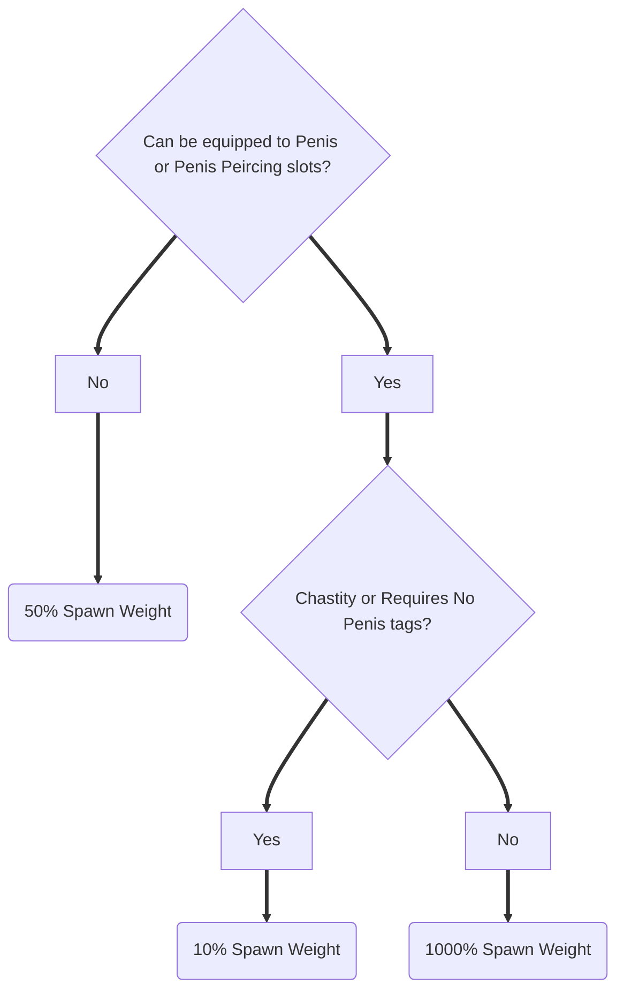

# Enchantments
## Disclaimer
This is a mod for the text-based erotic RPG [Lilith's Throne](https://github.com/Innoxia/liliths-throne-public). Do not access the contents of this repository unless you're allowed to consume pornographic materials according to the laws of your local area.

## Description
This is a collection of pre-made enchantments that will sometimes be applied to randomly-generated items, like those you will sometimes find when travelling through alleyways.
Currently, this collection has only 1 enchantment.

### Mega 'Milk'
Similar properties to the default enchantments of the "Mega Milk" T-Shirt, but applied to the wearer's penis and cum instead of their breasts and milk.
<!--

-->
10% spawn weight on items with the 'Chastity' and 'Requires no penis' tags, 10x spawn weight on items without those tags that can be equipped on the Penis or Penis Peircing slots, 50% spawn weight on all other items.

## Installation
To install this mod, copy the `condarbi` folder into the `res/mods` folder like so:
```
.
├── data
├── Lilith's Throne-0.4.11.3.jar
└── res
    ├── characters
    ├── clothing
    ├── colours
    ├── combatMove
    ├── dialogue
    ├── encounters
    ├── fonts
    ├── images
    ├── items
    ├── keybinds
    ├── maps
    ├── mods
    │   ├── condarbi
    │   │   └── randomEnchantments
    │   ├── innoxia
    │   └── modding.txt
    ├── outfits
    ├── patchNotes
    ├── patterns
    ├── race
    ├── randomEnchantments
    ├── setBonuses
    ├── sex
    ├── statusEffects
    ├── tattoos
    ├── txt
    └── weapons
```
## Updates
Updates can be found at [the Github page](https://github.com/CondarBi/Enchantments), with major updates or important patches also being available on the official LT Discord server.

The first and most recent versions of this mod were developed with LT version 0.4.11.3. If later updates to the game break this mod, notify me so I can fix it when I have the time.
